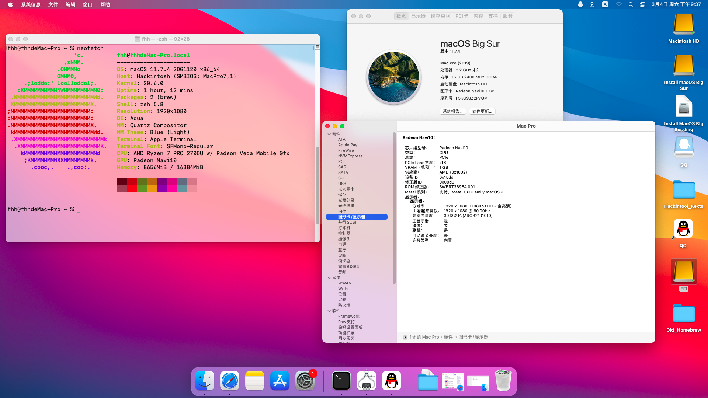

# HACKINTOSH-HP-ELITEBOOK-745-G5
Hackintosh for HP Elitebook 745 G5 laptop. 
# Hardware
* HP Elitebook 745 G5 laptop  
* AMD Ryzen 7 2700U  
* 16GB Memory  
* AMD Vega 10 Graphics  
# Version
11. 0 Big Sur

# Kexts  
* AirportItlwm
* Lilu
* NVMeFix
* RealtekRTL8111
* VirtualSMC
* WhateverRed

# Working

+ Graphics (QE/CI)
+ USB
+ Wi-Fi
+ Ethernet

# Not Working

* Sound card (Neither AppleALC nor VoodooHDA)
* Trackpad
* Original PM981 SSD (you **MUST** change to another SSD)
* Up to test.  

# Screenshot

